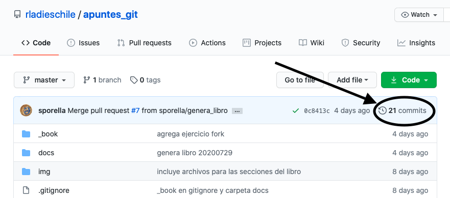
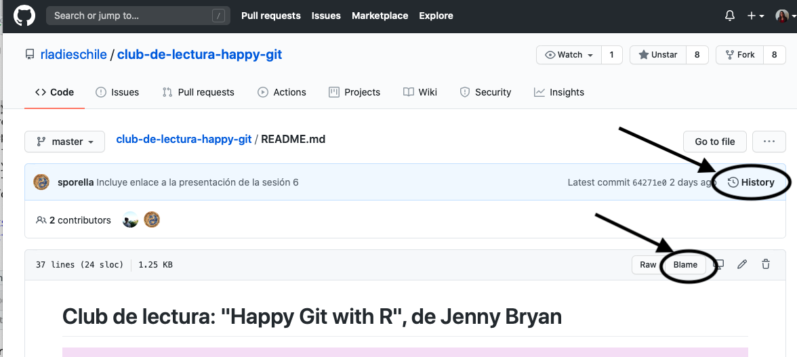
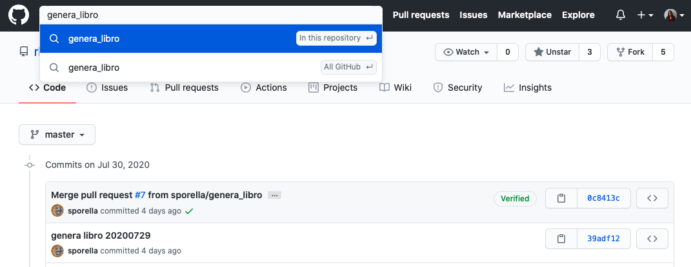

# Flujos de trabajo colaborativo {#flujos_de_trabajo}

**Traducción del capítulo 29 "Time travel: See the past" del libro de "Happy Git with R" de Jenny Bryan**

A veces necesitarás volver a revisar varios documentos de tu proyecto, debido a que lo que buscas esta bastantes atrás. Por ejemplo: 
  - "Me gusto más la paleta de colores que usamos en la visualización la semana pasada" 
  - "¿Qué paso que tenemos un outlier en la figura nº2?"
  - "No esta funcionando correctamente en Windows hace dos semanas" 
Seguramente para resolver todos estos problemas, tendrás que viajar en el tiempo al pasado de tus archivos y bases de datos.

## ¡Los hipervínculos (hyperlinks) son increíbles! 

Esta es una de las funciones con la que GitHub (y GitLab o BitBucket) realmente destacada. Podemos rapidamente explorar diferentes commits/states, cambiar entre branches, inspeccionar documentos individuales, y revisar la discusión entre issues, lo que lo hace una herramienta increiblemente poderosa. 

Sí, tecnicamente, puedes visitar todos los pasados states de tu proyecto usando los comandos de Git localmente; pero esa opción es significamente más incomoda de realizar. Para eso, en general, tienes que revisar states antigüos, lo que acrecienta la probabilidad de cómeter algún error agregando modificaciones en la incorrrecta branch (rama).

El trabajo con los hypelinks de GitHub en tu repositorio e historial es una de las principales razones para realizar la sincronización del trabajo local con un copia en GitHub. Dado a que claramente involucra acciones remotas y de solo lectura, no hay posibilidades de comprometer un nuevo trabajo en la rama equivocada. 

## Examinar el historial de commits 

Para ingresar al historial de commits, haz click a la izquierda en el boton llamado "xyz commits" (cómo se ve en la imagen nº1). Cada repositorio contará con un número distinto en donde esta "xyz", que corresponderá al número total de commits realizados en el pasado. Según el cliente del local Git, al hacer click incluso podrás visualizar una descripción gráfica del historial. 

**Imagen nº1: Acceso al historial de todos los commits ya realizados.**



Al ingresar al historial de los commits, tendrás tres formas de obtener más información sobre cada commit en específico:

  1. Usando el icono de un portapapeles (o clipboard) copias el SHA-1 del commit. Al hacer eso, facilita que puedas hacer referencia a este en otros medios o documentos. Por ejemplo, puedes usarlo para hacer referencia a ese commit en específico en un issue o una conversación sobre ello. 

  2. Haz click en el SHA-1 abreviado para ver las diferencias asociadas con el commit. El SHA-1 abreviado son los números y letras juntos a la derecha. 

  3. Haz click en los brackets dobles <> para revisar el estado del repositorio completo en ese momento.  

  **Imagen 2: Ejemplo sobre cómo ver los detalles de cada commit en específico.**


Para volver a la página principal del repositorio, solo haz click en YOU/REPO que aparece arriba a la izquierda. De esa forma, irás de regreso al estado actual del repositorio. 

Una vez que identifiques el commit (o diff o file state) que buscabas, puedes copiar el URL de la web, y usarlo para promover la discusión online en otro lado. De esta forma, por ejemplo, puedes atraer a otras personas a la vista exacta del repositorio. Este uso de los hyperlinks puede hacer que la discussión online sea mucho más precisa y eficiente.   

## Consultas basadas en archivos

¿Qué pasa si estas interesado/a por cómo un archivo específico llego a ser cómo es? Entonces lo que tienes que hacer es ir al archivo de tu interés, y localizar los botones "Blame" y "History" en la esquina superior derecha (ver imagen nº3)

**Imagen 3: Cómo revisar más detalles de  documento (file) específico en GitHub.**



**"Blame":** Esta visión del archivo esta relacionado con ciertos detalles sobre el origen de las líneas de comando. Te mostrará quién modificó por última vez cada línea del archivo, hace cuanto tiempo y el mensaje de confirmación asociado a ello. Haz click en el mensaje del commit para ver ese commit. O puedes hacer click en el icono con forma de rectángulos apilados para retrocede más en el tiempo, siguiendo en la forma de verlo desde "Blame". Puede ser útil para cuando se hace un análisis del proceso en un conjunto específico y pequeño de las líneas de comando. 

**"History":** Al ver en el “history” de un archivo, podrás visibilizar los commits que afectan el archivo de interés. Esto lo verás de forma muy similar al historial completo de commits visto anteriormente. Este boton es útil para cuando estas intentando comprender algo medio difuso, y este historial ayuda a tener un marco general de la historia del archivo.

**Hyperlinks a una línea específica en una fecha específica**

Cuando estes viendo un documento (file) en GitHub, puedes hacer clikc en el número de una línea para destacarlo. Usa “click … shift-click” para seleccionar un rango de líneas. Un ejemplo de esto entregado por Jenny Bryan, lo encuentras en el siguiente link:

```{}
https://github.com/OWNER/REPO/blob/SHA/path/to/file.R#L27-L31
```

Si el URL no contiene el SHA, escribe "y" para alternar en esa forma. 

El uso de estas URL y SHA específicos son una excelente forma de indicar a otras personas unas líneas de código en particular durante conversaciones en línea. Si puedes, y cómo buena práctica, usa los links más feos que contienen el SHA, ya que estos resistirán el paso del tiempo. 

## Buscar información en GitHub

Para realizar cualquier búsqueda, Github cuenta siempre con el buscador en la esquina izquierda superior (ver imagen nº4).

**Imagen 4: Barra de búsqueda de GitHub.**



Una vez que ingreses un texto en la barra de búsqueda, un menú se desplega, entregandote la opción de buscar en el respositorio actual (el predeterminado) o en todo GitHub. Lo que hace GitHub es buscar en los contenidos de los documentos (files o descritos cómo "codes"), mensajes de commits y en los issues. Por lo cual puedes tomar ventaja de los resultados de búsqueda en estos diferentes dominios. Esta herramienta permite un preciso acercamiento a las líneas de códigos, volver a visitar un momento específico en el historial del proyecto de tu interes, o volver a descubrir una conversación. 

**Búsqueda sobre un Issue específico**

Si lo que necesitas es buscar sobre un issue específico, entonces en el cuadro de búsqueda de cualquier página con los issues de un repositorio, escribe primero los filtros is:issue o is:open.

